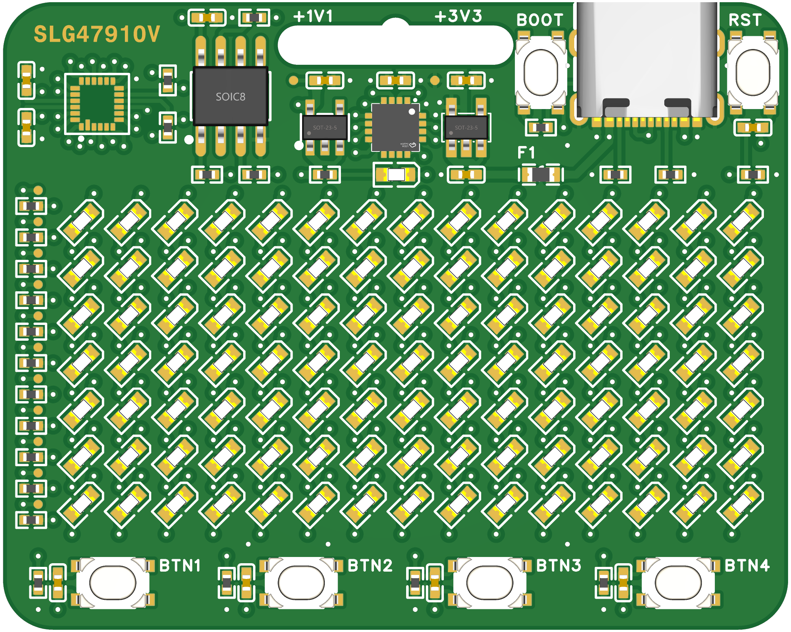

# LogicCard


> **Note:** This project is currently under active development. PCB layout is complete and the focus is now on firmware development and generating example FPGA bitstreams.

## Project Overview

The LogicCard is a compact and affordable FPGA development board featuring the Renesas SLG47910V FPGA with integrated USB programming via a CH552 microcontroller. The board includes an 11-pin Charlieplexed LED matrix (15×7 LEDs) and 4 user buttons, making it ideal for portable FPGA demonstrations and learning projects. The resistors for the LED matrix can be desoldered and the test points can be used for external applications.



### Key Features

- **FPGA**: Renesas SLG47910V (24-pin STQFN)
  - 1120 5-bit Look-Up Tables (LUTs)
  - 1120 D-type Flip-Flops (DFFs)
  - 5 kb distributed SRAM
  - 32 kb embedded Block RAM (BRAM)
  - 19 GPIOs available
  - 50 MHz on-chip oscillator
  - Phase-Locked Loop (PLL)
  - Advanced 6-input 2-output lookup table (LUT) structure for increased efficiency in high-usage designs
  - Low price that opens the low-density FPGA market to customers of all sizes (50 Cents at high volume)
  
- **USB Programming**: CH552 microcontroller implementing serprog protocol
- **Configuration Storage**: External SPI NOR Flash (W25Q80DVSNIG - 1 Mbit)
- **User Interface**: 15×7 LED matrix (105 LEDs) using 11 GPIO pins + 4 buttons
- **Power**: USB-powered with dual LDO regulation (5V → 3.3V → 1.1V)

---

## 2. Complete Pinout Tables

### 2.1 SLG47910V FPGA Pinout

| Pin | Name | Description | Net |
|-----|------|-------------|-----|
| 1 | GPIO10 | General Purpose I/O | CHRLY_3 |
| 2 | GPIO11 | General Purpose I/O | CHRLY_4 |
| 3 | GPIO12 | General Purpose I/O | CHRLY_5 |
| 4 | GPIO13 | General Purpose I/O | CHRLY_6 |
| 5 | GPIO14 | General Purpose I/O | CHRLY_7 |
| 6 | GPIO15 | General Purpose I/O | CHRLY_8 |
| 7 | GPIO16 | General Purpose I/O | CHRLY_9 |
| 8 | GPIO17 | General Purpose I/O | CHRLY_10 |
| 9 | GPIO18 | General Purpose I/O | CHRLY_11 |
| 10 | EN(nSLEEP) | Enable / Sleep (active low) | FPGA_EN |
| 11 | PWR(nRST) | Power / Reset (active low) | FPGA_RST |
| 12 | GND | Ground | GND |
| 13 | GPIO0 | General Purpose I/O | BUTTON_1 |
| 14 | GPIO1 | General Purpose I/O | BUTTON_2 |
| 15 | GPIO2 | General Purpose I/O | BUTTON_3 |
| 16 | GPIO3/SPI_CLK | GPIO 3 / SPI Clock | SPI_SCK |
| 17 | GPIO4/SPI_SS | GPIO 4 / SPI Chip Select | SPI_CS |
| 18 | GPIO5/SPI_SI | GPIO 5 / SPI Slave In | SPI_MISO |
| 19 | GPIO6/SPI_SO | GPIO 6 / SPI Slave Out | SPI_MOSI |
| 20 | GPIO7 | General Purpose I/O | BUTTON_4 |
| 21 | VDDIO | I/O Supply Voltage | +3.3V |
| 22 | VDDC | Core Supply Voltage | +1.1V |
| 23 | GPIO8 | General Purpose I/O | CHRLY_1 |
| 24 | GPIO9 | General Purpose I/O | CHRLY_2 |

### 2.2 CH552 Microcontroller Pinout

| Pin | Name | Description | Net |
|-----|------|-------------|-----|
| 1 | V33 | Internal USB power regulator | +3.3V |
| 2 | MOSI/PWM1/TIN3 | Port 1.5 | SPI_MOSI |
| 3 | T2_/CAP1_/SCS | Port 1.4 | SPI_CS |
| 4 | TXD1_/INT0/VBUS1 | Port 3.2 | LED |
| 5 | MISO/RXD1/TIN4 | Port 1.6 | SPI_MISO |
| 6 | SCK/TXD1/TIN5 | Port 1.7 | SPI_SCK |
| 7 | RST/T2EX_/CAP2_ | Reset | Reset |
| 8 | T2/CAP1/TIN0 | Port 1.0 | FPGA_RST |
| 9 | PWM2_/TXD | Port 3.1 | NC |
| 10 | PWM1_/RXD | Port 3.0 | NC |
| 11 | T2EX/CAP2/TIN1 | Port 1.1 | NC |
| 12 | INT1 | Port 3.3 | FPGA_EN |
| 13 | PWM2/RXD1_/T0 | Port 3.4 | NC |
| 14 | UDP | Port 3.6 | USB_D+ |
| 15 | UDM | Port 3.7 | USB_D- |
| 16 | VCC/VDD | Power | +3.3V |
| 17 | GND/VSS | GND | GND |

### 2.3 W25Q80DVSNIG Flash Memory Pinout

| Pin | Name | Description | Net |
|-----|------|-------------|-----|
| 1 | /CS | Chip Select (active low) | SPI_CS |
| 2 | DO(IO1) | Data Out / I/O 1 | SPI_MISO |
| 3 | /WP(IO2) | Write Protect (active low) / I/O 2 | Pull-up +3.3V |
| 4 | GND | Ground | GND |
| 5 | DI(IO0) | Data In / I/O 0 | SPI_MOSI |
| 6 | CLK | Clock | SPI_SCK |
| 7 | /HOLD(IO3) | Hold (active low) / I/O 3 | Pull-up +3.3V |
| 8 | VCC | Supply Voltage | +3.3V |

### 2.4 LED Matrix Charlieplex Connections

| FPGA GPIO | FPGA Pin | Matrix Pin | Function |
|-----------|----------|------------|----------|
| GPIO8 | 23 | CHRLY_1 | Charlieplex Pin 1 |
| GPIO9 | 24 | CHRLY_2 | Charlieplex Pin 2 |
| GPIO10 | 1 | CHRLY_3 | Charlieplex Pin 3 |
| GPIO11 | 2 | CHRLY_4 | Charlieplex Pin 4 |
| GPIO12 | 3 | CHRLY_5 | Charlieplex Pin 5 |
| GPIO13 | 4 | CHRLY_6 | Charlieplex Pin 6 |
| GPIO14 | 5 | CHRLY_7 | Charlieplex Pin 7 |
| GPIO15 | 6 | CHRLY_8 | Charlieplex Pin 8 |
| GPIO16 | 7 | CHRLY_9 | Charlieplex Pin 9 |
| GPIO17 | 8 | CHRLY_10 | Charlieplex Pin 10 |
| GPIO18 | 9 | CHRLY_11 | Charlieplex Pin 11 |

### 2.5 User Button Connections

| Button | FPGA GPIO | FPGA Pin |
|--------|-----------|----------|
| BUTTON_1 | GPIO0 | 13 |
| BUTTON_2 | GPIO1 | 14 |
| BUTTON_3 | GPIO2 | 15 |
| BUTTON_4 | GPIO7 | 20 |

---

## 3. Configuration and Programming

### 3.1 Configuration Mode

The SLG47910V is configured to use **External SPI Flash Mode** (SPI Master):
- FPGA acts as SPI Master during configuration
- External SPI Flash (W25Q80) acts as SPI Slave
- GPIO4 (SPI_SS) has a 10kΩ pull-up ensuring HIGH at power-up

### 3.2 Programming Sequence

**Typical Operation Sequence:**
1. MCU asserts FPGA_RST to hold FPGA in reset
2. MCU takes control of SPI bus and writes configuration data to Flash
3. MCU releases FPGA_RST
4. FPGA boots and reads configuration from the same SPI Flash
5. FPGA becomes operational

### 3.3 Bitstream Size

- Required: **384 kbit** (48 KB) for full configuration
- Available: **1 Mbit** (128 KB) in W25Q80 Flash

---

## 4. LED Matrix Operation

### 4.1 Charlieplexing Details

The 15×7 LED matrix (105 LEDs) is controlled using **11 GPIO pins** via Charlieplexing:

**Formula:**
```
Maximum LEDs = n × (n - 1)
With 11 pins: 11 × 10 = 110 possible LEDs
Actual usage: 105 LEDs (15 rows × 7 columns)
```

### 4.2 Current Limiting

Each Charlieplex pin should have a series resistor (82Ω) for current limiting:
- Forward voltage (VF): ~2.0V (yellow LEDs)
- Forward current (IF): ~10 mA for visibility
- These resistors can be desoldered to use test points for external applications
- As one GPIO drives the anode and another the cathode, the total resistance is 2 × 82Ω = 164Ω

---

## 5. CH552 USB Programmer

### 5.1 serprog Protocol Implementation

The CH552 firmware implements the serprog protocol for flashrom compatibility:

**Supported Features:**
- USB 2.0 Full Speed (12 Mbps)
- SPI Master interface
- FPGA reset/enable control with bus arbitration
- Visual LED feedback during programming operations
- Compatible with standard flashrom tool

**USB Identifiers:**
- Vendor ID: 0x1a86 (WCH)
- Product ID: 0x5722
- Device Class: CDC
- Product String: "ch552-serprog"

**LED Behavior:**
- **On** during power-up and USB enumeration
- **Blinks** during USB configuration
- **Off** when idle and ready for commands
- **On** during flash programming operations (CH552 controls SPI bus)
- **Off** when FPGA is enabled (FPGA controls SPI bus)

### 5.2 Programming Commands

```bash
# Flash FPGA bitstream using flashrom
flashrom -p serprog:dev=/dev/ttyACM0 -w FPGA_bitstream_FLASH_MEM.bin

# Read current configuration
flashrom -p serprog:dev=/dev/ttyACM0 -r current_config.bin

# Erase flash
flashrom -p serprog:dev=/dev/ttyACM0 -E
```

---

## 6. Project Status & Roadmap

### Current Status
- [x] Schematic design completed
- [x] Component selection and BOM finalized
- [x] 3D model and render generated
- [x] PCB layout completed
- [x] CH552 serprog firmware implemented
- [x] FPGA example project (Charlieplexed LED matrix)
- [ ] Hardware testing and validation
- [ ] Documentation improvements

### Coming Soon
- Hardware testing results
- Additional FPGA example projects
- Demonstrations

---

## 7. Design Files Structure

```
LogicCard/
├── hardware/               # Hardware design files
│   ├── BOM.csv            # Bill of Materials
│   ├── Schematic.pdf      # Circuit schematic
│   ├── 3D.step            # 3D model (STEP format)
│   └── Render.png         # 3D render preview
├── firmware/              # CH552 firmware source code
│   ├── ch552_serprog/     # serprog protocol implementation
│   └── build/             # Compiled firmware binaries
├── fpga/                  # FPGA design files
│   ├── LogicCard.ffpga    # Main FPGA project file
│   └── ffpga/             # FFPGA build artifacts
│       ├── src/           # Verilog source files
│       └── build/         # Build output directory
│           └── bitstream/ # Generated bitstreams (.bin and .txt)
└── docs/                  # Documentation and datasheets
    ├── CH552.PDF          # CH552 microcontroller datasheet
    ├── SLG47910.pdf       # SLG47910V FPGA datasheet
    └── W25Q80DV.pdf       # W25Q80 Flash memory datasheet
```

---

## 8. Quick Start Guide

> **Note:** This guide will be updated once the hardware is manufactured and firmware is finalized.

### 8.1 Hardware Setup
1. Connect LogicCard to computer via USB-C cable
2. Hold the BOOT button to enter CH552 Bootloader Mode (for initial firmware setup)

### 8.2 CH552 Firmware Update (First Time Setup)
1. With BOOT button held, connect to computer
2. Use WCHISPTool or chprog to flash the CH552 firmware
3. See [firmware/ch552_serprog/](firmware/ch552_serprog/) for build instructions

### 8.3 Programming the FPGA
1. Install flashrom tool: `sudo apt install flashrom` (Linux) or build from source
2. Build your FPGA design using Renesas GoConfigure tool
3. Generate bitstream file (.bin)
4. **Pad the bitstream to 1MB** (flashrom requires full chip-size images):
   ```bash
   # Pad bitstream to match W25Q80 flash size (1MB)
   cp FPGA_bitstream_FLASH_MEM.bin FPGA_bitstream_FLASH_MEM_1MB.bin
   truncate -s 1M FPGA_bitstream_FLASH_MEM_1MB.bin
   ```
5. Flash using: `flashrom -p serprog:dev=/dev/ttyACM0 -w FPGA_bitstream_FLASH_MEM_1MB.bin`
6. FPGA automatically configures and runs

**Note:** The FPGA only uses the first 48KB (384 kbit) of the flash for configuration. The W25Q80 flash chip is 1MB (1,048,576 bytes), so flashrom requires the image to be padded to the full chip size.

---

## 9. Specifications Summary

| Parameter | Value |
|-----------|-------|
| FPGA Logic | 1120 LUTs, 1120 DFFs |
| Memory | 5kb SRAM + 32kb BRAM |
| I/O Pins | 19 GPIOs |
| Clock | 50 MHz internal oscillator + PLL |
| Flash Storage | 1 Mbit SPI NOR (W25Q80) |
| USB Interface | Full Speed (12 Mbps) |
| LED Matrix | 15×7 (105 LEDs) |
| User Buttons | 4 |
| Power | USB 5V → 3.3V (TLV70233) → 1.1V (TLV74311) |
| Voltage Regulators | TLV70233DBVR (3.3V), TLV74311PDBVR (1.1V) |
| Programming | serprog/flashrom compatible |

---

## 10. Contributing

This is an open-source hardware project. Contributions, suggestions, and feedback are welcome!

### How to Contribute
- Report issues or suggest features via GitHub Issues
- Submit pull requests for improvements
- Help improve documentation

---

## 11. Resources & References

### Datasheets
- [SLG47910V Datasheet](https://www.renesas.com/document/dst/slg47910-datasheet) - Renesas FPGA
- [W25Q80DV Datasheet](https://www.winbond.com/resource-files/w25q80dv_revg_07212015.pdf) - Flash Memory
- [CH552 Datasheet](https://www.wch-ic.com/downloads/CH552DS1_PDF.html) - USB MCU

### Software Tools
- **GoConfigure**: Official Renesas FPGA development tool
- **flashrom**: Open-source flash programmer
- **SDCC**: Small Device C Compiler for CH552

### Example Code
- [ch552_serprog](https://github.com/ieiao/ch554_sdcc) - CH552 serprog implementation
- [Charlieplexing Examples](https://en.wikipedia.org/wiki/Charlieplexing) - LED matrix control

---

## 12. License

This project is licensed under the **CERN Open Hardware Licence Version 2 - Weakly Reciprocal (CERN-OHL-W)**. See the [LICENSE](LICENSE) file for full details.

## 13. Credits & Acknowledgments

- **Renesas** for providing SLG47910V FPGA samples and development tools
- **ieiao** for the [CH552 serprog implementation](https://github.com/ieiao/ch554_sdcc)
- The open-source hardware and FPGA community

## 14. Contact & Support

For questions, issues, or suggestions:
- Open an issue on GitHub
- Check the [docs/](docs/) folder for datasheets and technical documentation
- Review the schematic and BOM in the [hardware/](hardware/) folder

**Last Updated:** 2025-11-12
**Project Status:** Hardware Complete - Firmware and RTL Development Phase
